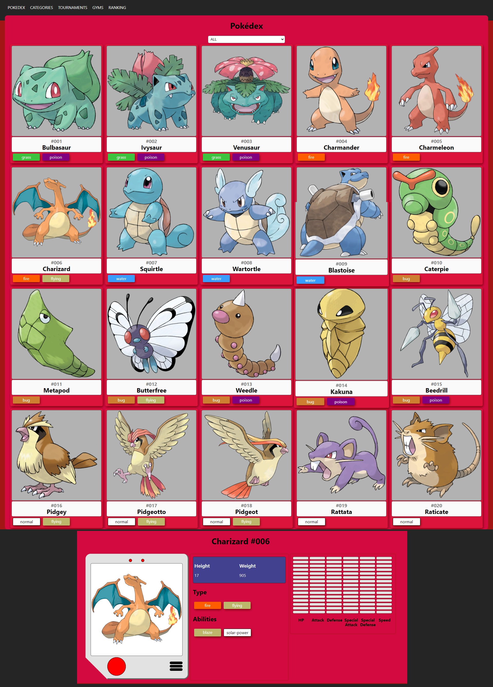

# React Pokédex

> A Podédex App build with React for Microverse Capstone Project.




## Built With

- React
- HTML5
- SASS
- NPM
- Heroku

## Live Demo

[Poke-Link](https://safe-island-02494.herokuapp.com/)


## Getting Started

To get a local copy up and running follow these simple example steps.

### Prerequisites

- Git
- npm

### Setup

Clone or download the repo:

```
git clone https://github.com/abdelp/poke-catalog-react.git
```

### Install

Go to the root folder and install the npm packages:

```
npm i
```

### Usage

After installing all of the npm packages, run the start script command:

```
npm start
```

### Run tests

To run the tests go to the root folder of the project and run the test script command:

```
npm test
```

### Deployment

To be able to deploy the app on Heroku you need to have installed the [Heroku CLI](https://devcenter.heroku.com/articles/heroku-cli) first.

After that, you need to run the command to create your new project there:

```
heroku create -b https://github.com/mars/create-react-app-buildpack.git
```

And push the files there:

```
git push heroku master
```

## Author

👤 **Abdel Pérez**

- Github: [@abdelp](https://github.com/abdelp/)
- Twitter: [@AbdelPerez11](https://twitter.com/abdelperez11)
- Linkedin: [Abdel Pérez](https://www.linkedin.com/in/abdel-perez/)


## 🤝 Contributing

Contributions, issues, and feature requests are welcome!

Feel free to check the [issues page](issues/).

## Show your support

Give a ⭐️ if you like this project!

## Acknowledgments

- Microverse Inc.

## 📝 License

This project is [MIT](lic.url) licensed.